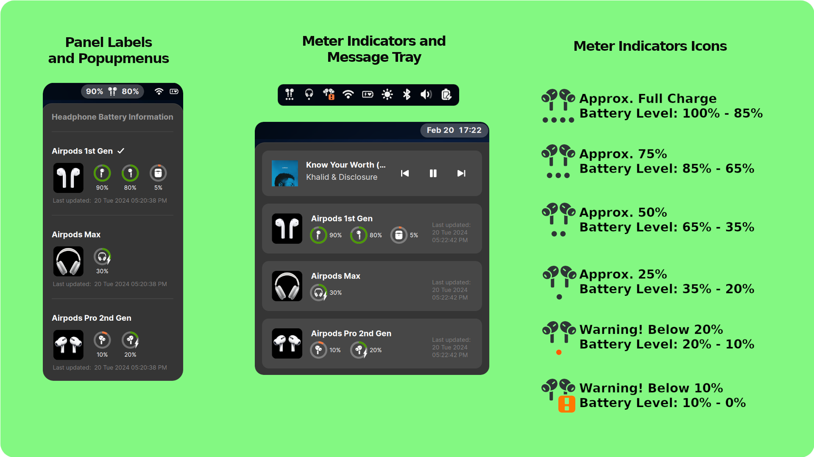
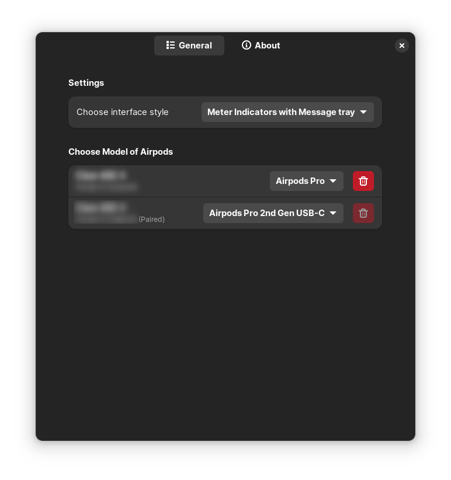

# Airpod Battery Monitor
[](https://extensions.gnome.org/extension/6778/airpod-battery-monitor/)
[](https://github.com/maniacx/Airpod-Battery-Monitor)

{: .important-title }
> Currently supported on Gnome Versions:
> 
> `43, 44, 45`

**Airpod Battery Monitor is a Gnome Extension to report AirPods/Beats headphone battery level, using indicator icons as battery meter in system tray and message tray, or using Panel button with PopupMenus**
<br>
<br>

{: .note }
>
> * This extension is not compatible with Bluetooth configurations in BR/EDR-only mode. Dual mode is required.
> * As this extension initiates the discovery mode, it may lead to audio distortion on Broadcom Bluetooth adapters when the extension is running. If audio distortion occurs while playing audio and opening Gnome Settings > Bluetooth, the same issue may arise when using this program, as both involve starting the discovery process.


<br>
<br>



---

# Feature

* Display Battery information status for AirPods and Beats headphone
* Option to choose user interface. Panel labels with popupmenu and Meter Indicator Icon with information on Message tray.

---

# How does it work

* AirPods do not provide battery information through Bluetooth Battery Service (BAS) like other Bluetooth headsets/devices.
* Instead, AirPods utilize BLE advertising packets containing Battery Information and model.
* To address privacy concerns, the BLE MAC address of AirPods is randomized every 15 minutes.
* This randomization makes it challenging to identify whether the broadcasting AirPods is the one connected to the device or a different AirPods nearby.
* The extension functions by searching for all nearby broadcasting AirPods, filtering them based on the matching model, and selecting the one with the strongest signal.
* Finally, the extension displays the Battery information of the chosen Airpod.

<br>

{: .note }
>
> * If there are two AirPods of the same model, the extension will choose the one with the strongest signal. Therefore, there is no guarantee which AirPods will be displayed if they report the same signal strength.
> * Scanning and discovering AirPods takes time, so the extension may take up to a minute to display battery information.
> * In Gnome, when the screen is locked, extensions are disabled. When the screen is unlocked, the extension is enabled. Therefore, do not expect the AirPods battery information to be displayed instantaneously during screen lock.

---

# How to use
* Enable the extension in your system settings.
* Once AirPods are connected to your system, they will be listed in the extension preferences.
* Choose the specific AirPods model in the preferences, and the extension will commence scanning for the BLE beacon advertising that model.
* The extension will then display the battery information of the AirPods with the strongest Bluetooth signal.
 
---

# Extension Preference



### Choose model of Airpod
* This section comprises the list of paired or connected AirPods.
* The extension will only start scanning for the AirPods when correct model is chosen.
* The selected model is then compared with the BLE advertising model variant, and upon a match, the nearest AirPods of that model is selected to report battery levels.
* The information is persistently stored, even after the AirPods is unpaired, for future reference.
* If you wish to discontinue the use of an Airpod, you can remove it from the list using the `Delete` button. This button is accessible only when the AirPods is unpaired from the system.

---

# Verify Bluetooth Adapter Controller Mode

If the extension is continuously scanning and unable to detect AirPods, examine the contents of a system file.

```
/etc/bluetooth/main.conf
```

If `ControllerMode = bredr`, the extension will not function correctly since it relies on `le` mode to retrieve AirPods battery information.

To resolve this, switch the adapter to Dual mode by executing the following command:
Locate the line `ControllerMode = bredr` and modify it to `ControllerMode = dual`

Restart Bluetooth Service

```
sudo systemctl restart bluetooth
```

Disable and Enable the extension.

{: .note }
>
> * Some Bluetooth adapters may not pair/connect AirPods in `ControllerMode = dual`. So after switching to Dual please check, pairing, unpairing, and audio playpack with AirPods.


